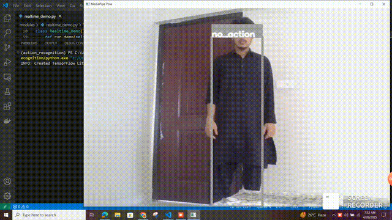

# Action Recognition using Body Landmarks and RNN

A real-time action recognition system that detects human actions like jump, duck, right tilt, left tilt, and no action, using body landmarks and a Recurrent Neural Network (RNN) with LSTM cells.

---

## 🚀 Overview

This project identifies five different body actions:

- `Jump`
- `Duck`
- `Right Tilt`
- `Left Tilt`
- `No Action`

The pipeline involves:

- Using **MediaPipe's Body Landmarker** to extract body landmarks from video frames.
- Passing sequences of landmarks into an **RNN model** built with **LSTM cells** to recognize temporal patterns in motion.
- Applying additional **programming logic** to refine predictions of `Right Tilt` and `Left Tilt`, improving robustness when the model struggles to differentiate subtle motions.

---

## 🗂️ Dataset Creation

- **Recorded custom videos** for each action.
- **Extracted frames** from the videos.
- **Rescaled images** to normalize body proportions across different individuals.
- **Extracted body landmarks** using MediaPipe.
- Built sequences of landmarks to serve as input for RNN training.

---

## 🎥 Demo

